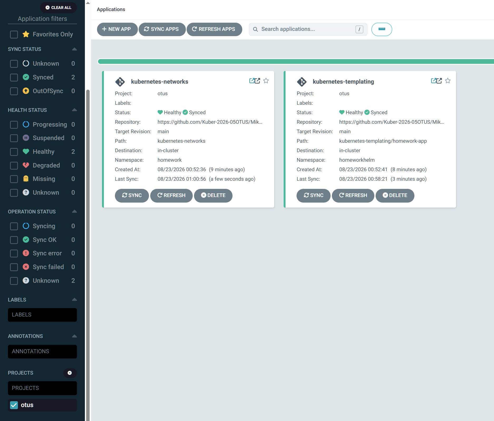

# Выполнено ДЗ № 10

- [x] Основное ДЗ

## В процессе сделано

- В кластер установлен Argo CD через Helm-чарт `argo/argo-cd`.
- Для установки использован файл [`argo_custom_values.yaml`](argo_custom_values.yaml): компоненты Argo CD планируются только на infra-ноды через `nodeSelector: node-role=infra` и `tolerations` для taint `node-role=infra:NoSchedule`.
- Создан Argo CD project [`argocd-project-otus.yaml`](argocd-project-otus.yaml) с именем `otus` для репозитория с ДЗ.
- Создано приложение [`argocd-application-networks.yaml`](argocd-application-networks.yaml) для манифестов из [`../kubernetes-networks`](../kubernetes-networks), sync policy — manual, namespace — `homework`.
- Создано приложение [`argocd-application-templating.yaml`](argocd-application-templating.yaml) для Helm-чарта [`../kubernetes-templating/homework-app`](../kubernetes-templating/homework-app), sync policy — auto, `prune` и `selfHeal` включены, namespace — `homeworkhelm`.
- Для Helm-приложения переопределён параметр `replicaCount=5`.

## Как запустить проект

### Установка Argo CD

```bash
helm repo add argo https://argoproj.github.io/argo-helm
```

```bash
helm search repo argo/argo-cd --versions
```

```bash
helm pull argo/argo-cd --untar
```

Установка выполнялась из каталога распакованного чарта с кастомными values из [`argo_custom_values.yaml`](argo_custom_values.yaml):

```bash
helm upgrade --install argocd . -n argo -f ./values.yaml -f ./argo_custom_values.yaml --rollback-on-failure --cleanup-on-fail --create-namespace
```

### Установка Argo CD CLI

```bash
wget -O argocd-linux-amd64 https://github.com/argoproj/argo-cd/releases/latest/download/argocd-linux-amd64
```

```bash
sudo install -o root -g root -m 0755 argocd-linux-amd64 /usr/local/bin/argocd
```

### Создание project и applications

```bash
kubectl apply -f kubernetes-gitops/argocd-project-otus.yaml
kubectl apply -f kubernetes-gitops/argocd-application-networks.yaml
kubectl apply -f kubernetes-gitops/argocd-application-templating.yaml
```

## Проверка

```bash
kubectl get pods -n argo -o wide
kubectl get appproject -n argo
kubectl get applications -n argo
```

Для проверки размещения Argo CD на infra-нодах:

```bash
kubectl get pods -n argo -o wide
kubectl describe node worker-03.mvl.test | grep -A5 Taints
```

Для проверки приложений:

```bash
kubectl get all -n homework
kubectl get all -n homeworkhelm
```

Скриншот интерфейса Argo CD приложен в [`screenshots/argo-gui.png`](screenshots/argo-gui.png).



## PR checklist

- [x] Выставлен label с темой домашнего задания

