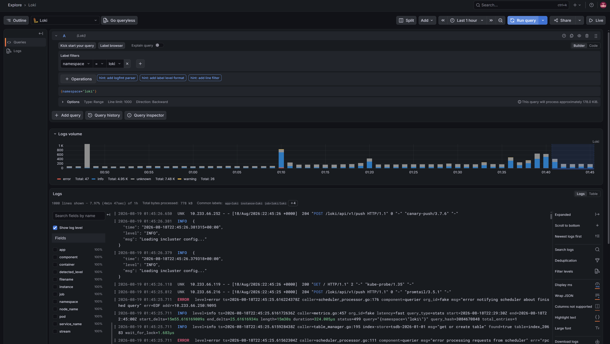

# Выполнено ДЗ № 9

- [x] Основное ДЗ

## В процессе сделано

- Для инфраструктурной ноды `worker-03.mvl.test` добавлен label `node-role=infra`.
- Для инфраструктурной ноды `worker-03.mvl.test` добавлен taint `node-role=infra:NoSchedule`, запрещающий планирование посторонней нагрузки.
- Создан S3-compatible bucket для хранения логов Loki и подготовлен ServiceAccount с ключами доступа.
- В кластер установлен Loki в monolithic-режиме с `auth_enabled: false`.
- Loki настроен на хранение логов в S3 bucket и планирование только на infra-ноды через `nodeSelector` и `tolerations` в [`loki/my-values.yaml`](loki/my-values.yaml).
- В кластер установлен Promtail как DaemonSet на все ноды, включая infra-ноды, за счёт общего toleration в [`promtail/my-values.yaml`](promtail/my-values.yaml).
- В кластер установлена Grafana на infra-ноды через `nodeSelector`, `nodeAffinity` и `tolerations` в [`grafana/my-values.yaml`](grafana/my-values.yaml).
- В Grafana настроен datasource Loki и проверено отображение логов в Explore.

## Как запустить проект

### Подключение Helm-репозиториев

```bash
helm repo add grafana-community https://grafana-community.github.io/helm-charts
```

```bash
helm repo add grafana https://grafana.github.io/helm-charts
```

### Скачивание чартов

```bash
helm pull grafana-community/loki --untar
helm pull grafana/promtail --untar
helm pull grafana-community/grafana --untar
```

### Создание secret с ключами доступа к S3

```bash
kubectl -n loki create secret generic loki-s3-credentials \
  --from-literal=S3_ACCESS_KEY_ID='***:***' \
  --from-literal=S3_SECRET_ACCESS_KEY='***'
```

### Установка Loki

Использованные values: [`loki/my-values.yaml`](loki/my-values.yaml).

```bash
helm upgrade --install loki ./loki -n loki -f loki/values.yaml -f loki/my-values.yaml --rollback-on-failure --cleanup-on-fail
```

### Установка Promtail

Использованные values: [`promtail/my-values.yaml`](promtail/my-values.yaml).

```bash
helm upgrade --install promtail ./promtail -n loki --create-namespace -f promtail/values.yaml -f promtail/my-values.yaml --rollback-on-failure --cleanup-on-fail
```

### Установка Grafana

Использованные values: [`grafana/my-values.yaml`](grafana/my-values.yaml).

```bash
helm upgrade --install grafana ./grafana -n monitoring --create-namespace -f grafana/values.yaml -f grafana/my-values.yaml --rollback-on-failure --cleanup-on-fail
```

## Конфигурация нод кластера

### Labels и taints для infra-ноды

```bash
kubectl label node worker-03.mvl.test node-role=infra
kubectl taint node worker-03.mvl.test node-role=infra:NoSchedule
```

### Вывод `kubectl get node -o wide --show-labels`

```text
NAME                 STATUS   ROLES           AGE   VERSION   INTERNAL-IP   EXTERNAL-IP   OS-IMAGE             KERNEL-VERSION      CONTAINER-RUNTIME    LABELS
master-01.mvl.test   Ready    control-plane   84d   v1.35.4   10.10.10.11   <none>        Ubuntu 24.04.4 LTS   6.8.0-136-generic   containerd://2.2.3   beta.kubernetes.io/arch=amd64,beta.kubernetes.io/os=linux,kubernetes.io/arch=amd64,kubernetes.io/hostname=master-01.mvl.test,kubernetes.io/os=linux,node-role.kubernetes.io/control-plane=,node.kubernetes.io/exclude-from-external-load-balancers=
master-02.mvl.test   Ready    control-plane   53d   v1.35.4   10.10.10.12   <none>        Ubuntu 24.04.4 LTS   6.8.0-136-generic   containerd://2.2.3   beta.kubernetes.io/arch=amd64,beta.kubernetes.io/os=linux,kubernetes.io/arch=amd64,kubernetes.io/hostname=master-02.mvl.test,kubernetes.io/os=linux,node-role.kubernetes.io/control-plane=,node.kubernetes.io/exclude-from-external-load-balancers=
master-03.mvl.test   Ready    control-plane   53d   v1.35.4   10.10.10.13   <none>        Ubuntu 24.04.4 LTS   6.8.0-136-generic   containerd://2.2.3   beta.kubernetes.io/arch=amd64,beta.kubernetes.io/os=linux,kubernetes.io/arch=amd64,kubernetes.io/hostname=master-03.mvl.test,kubernetes.io/os=linux,node-role.kubernetes.io/control-plane=,node.kubernetes.io/exclude-from-external-load-balancers=
worker-01.mvl.test   Ready    worker          84d   v1.35.4   10.10.10.21   <none>        Ubuntu 24.04.4 LTS   6.8.0-136-generic   containerd://2.2.3   beta.kubernetes.io/arch=amd64,beta.kubernetes.io/os=linux,homework=true,kubernetes.io/arch=amd64,kubernetes.io/hostname=worker-01.mvl.test,kubernetes.io/os=linux,node-role.kubernetes.io/worker=
worker-02.mvl.test   Ready    worker          55d   v1.35.4   10.10.10.22   <none>        Ubuntu 24.04.4 LTS   6.8.0-136-generic   containerd://2.2.3   beta.kubernetes.io/arch=amd64,beta.kubernetes.io/os=linux,kubernetes.io/arch=amd64,kubernetes.io/hostname=worker-02.mvl.test,kubernetes.io/os=linux,node-role.kubernetes.io/worker=
worker-03.mvl.test   Ready    worker          53d   v1.35.4   10.10.10.23   <none>        Ubuntu 24.04.4 LTS   6.8.0-136-generic   containerd://2.2.3   beta.kubernetes.io/arch=amd64,beta.kubernetes.io/os=linux,kubernetes.io/arch=amd64,kubernetes.io/hostname=worker-03.mvl.test,kubernetes.io/os=linux,node-role.kubernetes.io/worker=,node-role=infra
```

### Вывод `kubectl get nodes -o custom-columns=NAME:.metadata.name,TAINTS:.spec.taints`

```text
NAME                 TAINTS
master-01.mvl.test   [map[effect:NoSchedule key:node-role.kubernetes.io/control-plane]]
master-02.mvl.test   [map[effect:NoSchedule key:node-role.kubernetes.io/control-plane]]
master-03.mvl.test   [map[effect:NoSchedule key:node-role.kubernetes.io/control-plane]]
worker-01.mvl.test   <none>
worker-02.mvl.test   <none>
worker-03.mvl.test   [map[effect:NoSchedule key:node-role value:infra]]
```

## S3 object storage

Для хранения логов Loki подготовлен S3-compatible object storage. Скриншот с bucket приложен в [`loki/s3_buckets.png`](loki/s3_buckets.png).

В [`loki/my-values.yaml`](loki/my-values.yaml) настроено использование S3:

- `loki.storage.type: s3`
- bucket для chunks: `loki-chunks-otus`
- bucket для ruler: `loki-ruler-otus`
- endpoint: `https://s3.cloud.ru`
- credentials передаются в Loki через secret `loki-s3-credentials`

## Проверка Grafana Explore

В Grafana datasource Loki добавлен через provisioning в [`grafana/my-values.yaml`](grafana/my-values.yaml):

```yaml
url: http://loki-gateway.loki.svc.cluster.local
isDefault: true
```

Скриншот Explore с логами из Loki приложен в [`grafana/grafana-screenshot.png`](grafana/grafana-screenshot.png).



## PR checklist

- [x] Выставлен label с темой домашнего задания
